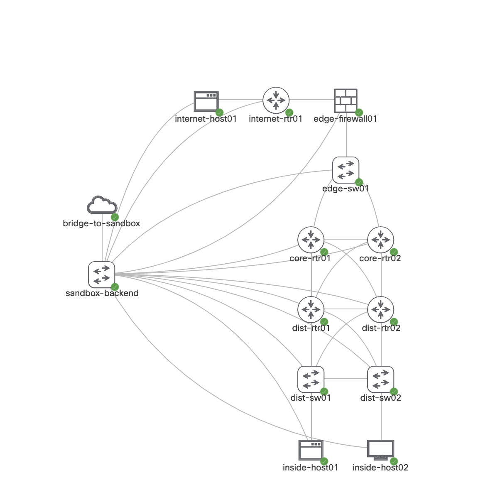

# Gold Config Audit and Enforcement
Code to audit and enforce a gold standard config across a range of devices

Lab Topology: 

Device list:

Usage:

1. Reserve a Cisco Modeling Labs sandbox at https://devnetsandbox.cisco.com/RM/Diagram/Index/685f774a-a5d6-4df5-a324-3774217d0e6b?diagramType=Topology
1. Once it is ready, click on the "Output" button, and use the VPN credentials to connect with AnyConnect or OpenConnect
1. SSH to 10.10.20.50 as the developer user with password C1sco12345
1. Execute the following to download pre-requisites: `/bin/bash -c "$(curl -fsSL https://raw.githubusercontent.com/securenetwrk/gold_config/master/setup.sh)"`
1. Execute `cd gold_config` to change to the correct directory
1. Execute `ansible-playbook 1_auditv2.yml -C -v` to see the state of the config audit
1. Optionally execute `ansible-playbook 1_auditv2.yml -v` to deploy the gold config config
1. Re-run `ansible-playbook 1_auditv2.yml -C -v` to see the new state of the config audit
