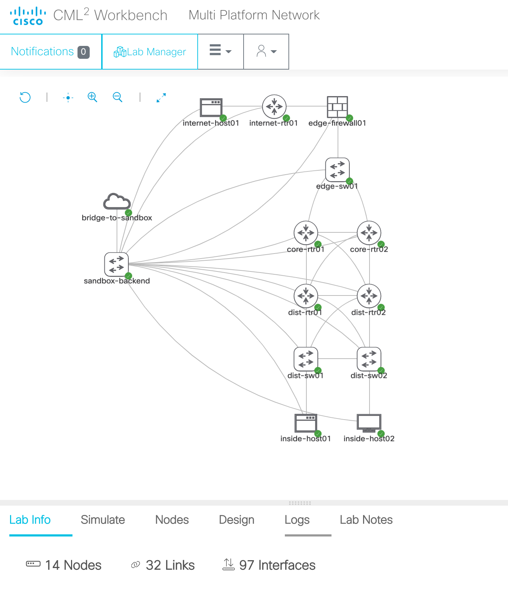
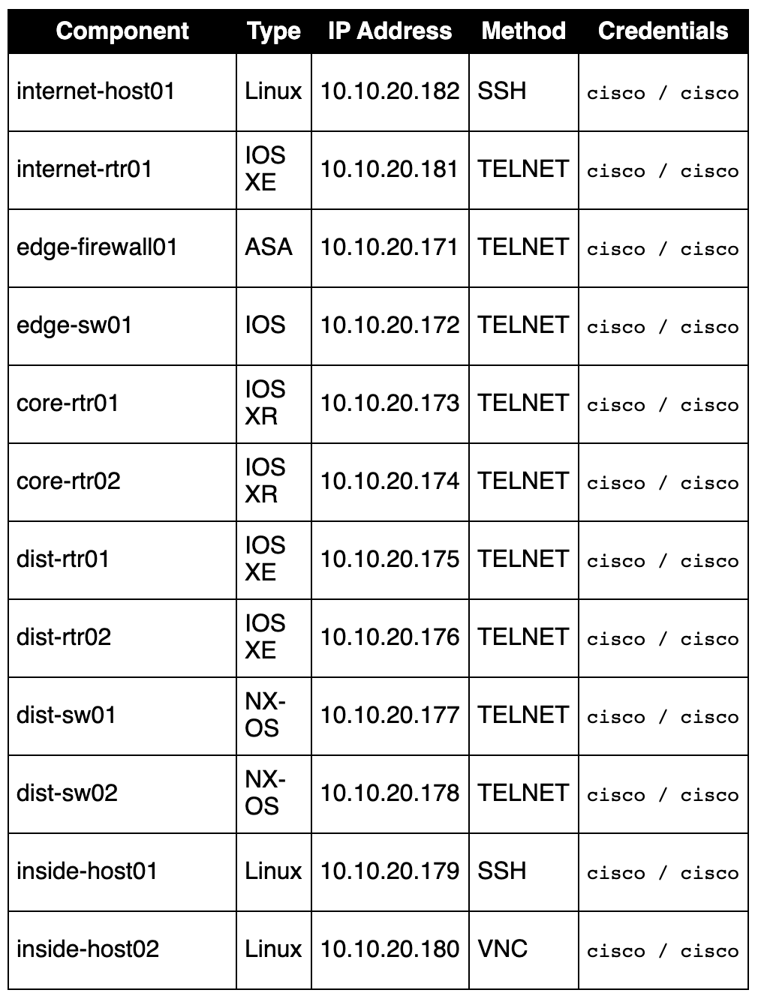

# Ansible Config Audit and Enforcement
Code to audit and enforce a gold standard config across a range of devices

# Objective 
This playbook, and the accompanying roles, are designed to illustrate how Ansible could be used to audit and enforce a set of baseline configs across multiple device types. The roles contain some sample configurations that might be included in an organization's baseline config, but they can be easily extended to add additional configs as well. 

# Requirements

To use this code you will need:

* Python 3.6+

Optionally, this code can be run as is in a [DevNet Cisco Modeling Labs sandbox](https://devnetsandbox.cisco.com/RM/Diagram/Index/685f774a-a5d6-4df5-a324-3774217d0e6b?diagramType=Topology)

With the above sandbox, you instead will need:
* Cisco VPN client - [Setup instructions here](https://developer.cisco.com/site/sandbox/anyconnect/)
* SSH client - Using Mac/Linux directly use the OS native SSH client. For connecting using an SSH client such as [PuTTY](https://www.chiark.greenend.org.uk/~sgtatham/putty/latest.html)

# Install and Setup

1. Reserve a Cisco Modeling Labs sandbox at [DevNet Cisco Modeling Labs sandbox](https://devnetsandbox.cisco.com/RM/Diagram/Index/685f774a-a5d6-4df5-a324-3774217d0e6b?diagramType=Topology)
1. Once it is ready, click on the "Output" button, and use the VPN credentials to connect with AnyConnect or OpenConnect
1. SSH to 10.10.20.50 as the developer user with password C1sco12345
1. Execute the following to download pre-requisites: `/bin/bash -c "$(curl -fsSL https://raw.githubusercontent.com/CiscoDevNet/ansible-config-audit/master/setup.sh)"`
1. Execute `cd ansible-config-audit` to change to the correct directory
1. Execute `ansible-playbook 1_audit.yml -C -v` to see the state of the config audit
1. Optionally execute `ansible-playbook 1_audit.yml -v` to deploy the gold config config
1. Re-run `ansible-playbook 1_audit.yml -C -v` to see the new state of the config audit

# Lab Topology: 

# Device list:

